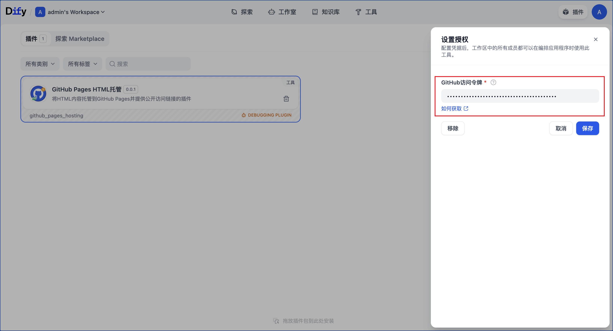

## github_pages_hosting

**Author:** sudong
**Version:** 0.0.1
**Type:** tool

### Description

A tool to help users quickly set up and deploy static websites on GitHub Pages. With simple steps, you can easily host your html content on GitHub Pages and share it with the world.

### User Guide

#### Step 1: Get GitHub Token

1. Go to GitHub [get token](https://github.com/settings/tokens)
2. Click "Generate new token" and select "Generate new token (classic)"

3. Give your token a descriptive name
4. Select the "repo" permission scope (required for GitHub Pages operations)

5. Click "Generate token"
6. **Important**: Copy and save your token immediately as it won't be shown again

#### Step 2: Install and Authorize the Plugin

1. Install the github_pages_hosting plugin to your environment
2. Launch the plugin and click on the "Authorize" button
3. Paste the GitHub token (classic) you generated in Step 1

4. Click "Confirm" to complete the authorization process

#### Step 3: Use the Tool in Your Workflow

1. In your workflow, add the github_pages_hosting tool
2. Pass your HTML content as a parameter to the tool:

3. Run the workflow
4. Once completed, the tool will return a `pages_url`

5. Visit this URL to access your published HTML content

### Note
Since GitHub Pages deployment takes some time, this tool will attempt to wait until the page becomes accessible before returning the link. Please be patient, as this usually takes around 30 seconds.

### Resources

- [GitHub Pages Official Documentation](https://docs.github.com/en/pages)
- [GitHub Authentication Documentation](https://docs.github.com/en/authentication)

